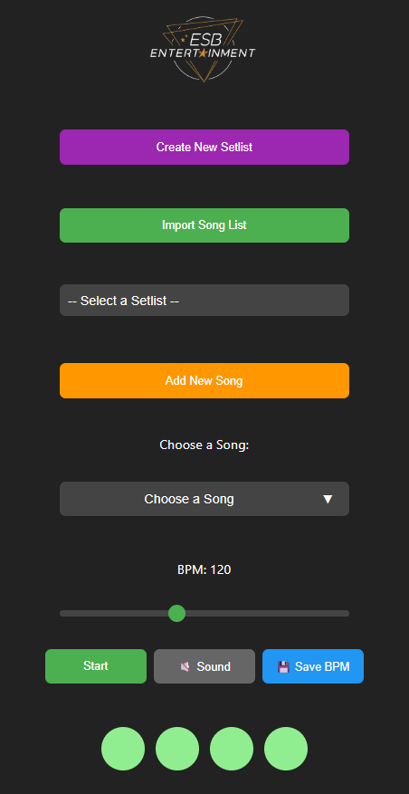

# 🎵 ESB Metronome

A modern, offline-capable metronome web application designed for musicians. Keep perfect time with this sleek and user-friendly tool.

## ✨ Features

- 🎯 Accurate timing and beat counting
- 📱 Progressive Web App (PWA) - works offline
- 🎨 Clean, modern interface
- 🎹 Customizable tempo and time signatures
- 📱 Responsive design - works on all devices
- 🌙 Dark theme for comfortable practice sessions

## 📸 Screenshot

## 🚀 Getting Started

1. Clone this repository
2. Open `index.html` in your web browser
3. Start practicing!

## 🛠️ Built With

- HTML5
- CSS3
- JavaScript

## 📧 Contact

If you have any questions or suggestions, please open an issue in the repository.

---

Made with ❤️ for musicians everywhere
